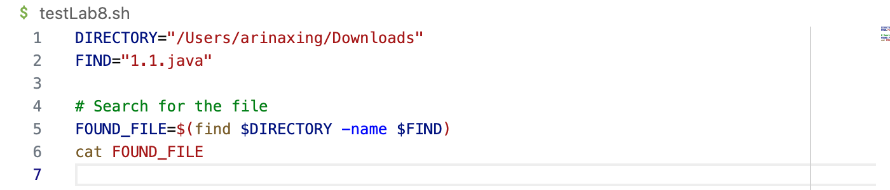
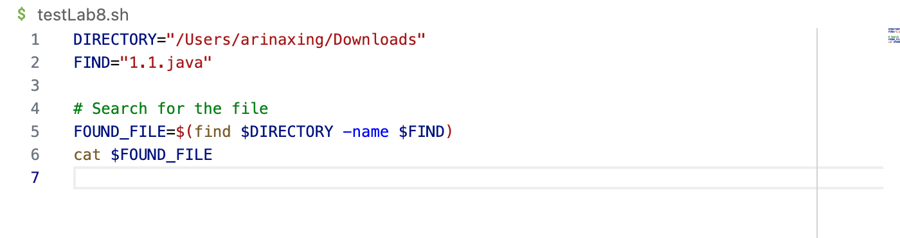
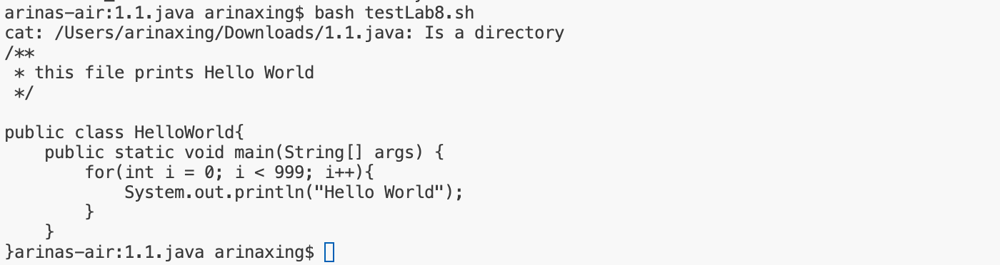

# Lab 8 Report
## Step 1: student post
Hi, I'm trying to look for this file titled 1.1.pdf through my bash script but I am encountering an error
with the following message (screenshot 1). The code for my bash script is in screenshot 2. Can someone explain to me why
this is happening?



## Step 2: TA response
First you want to check if this file is stored in the correct directory. I see that you went to ```Downloads``` so if you can,
searh for it in your downloads folder to see if it is actually there. 
Second, remember there is a symbol we use in front of a variable name to actually replace the variable with the value we declared 
it in the beginning. Can you remember what it is?

## Step 3: student post
Thank you, I see that I forgot the $ symbol in front of the ```FOUND_FILE``` variable. I can now print my java file.



## Step 4
file and directory needed:
```1.1.java``` and the directory was ```/Users/arinaxing/Downloads```

content of the ```1.1.java```
```
/**
 * this file prints Hello World
 */

public class HelloWorld{
    public static void main(String[] args) {
        for(int i = 0; i < 999; i++){
            System.out.println("Hello World");
        }
    }
}
```

command to trigger bug
bash ```testLab8.sh```

edit to fix the bug
add ```$``` to the front of ```FOUND_FILE```
